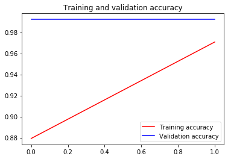

```python
# ATTENTION: Please do not alter any of the provided code in the exercise. Only add your own code where indicated
# ATTENTION: Please do not add or remove any cells in the exercise. The grader will check specific cells based on the cell position.
# ATTENTION: Please use the provided epoch values when training.

# Import all the necessary files!
import os
import tensorflow as tf
from tensorflow.keras import layers
from tensorflow.keras import Model
from os import getcwd
```


```python
path_inception = f"{getcwd()}/../tmp2/inception_v3_weights_tf_dim_ordering_tf_kernels_notop.h5"

# Import the inception model  
from tensorflow.keras.applications.inception_v3 import InceptionV3

# Create an instance of the inception model from the local pre-trained weights
local_weights_file = path_inception

pre_trained_model = InceptionV3(input_shape = (150, 150, 3),
                                include_top = False, 
                                weights = None)

pre_trained_model.load_weights(local_weights_file)

# Make all the layers in the pre-trained model non-trainable
for layer in pre_trained_model.layers:
    layer.trainable = False

# Print the model summary
pre_trained_model.summary()

# Expected Output is extremely large, but should end with:

#batch_normalization_v1_281 (Bat (None, 3, 3, 192)    576         conv2d_281[0][0]                 
#__________________________________________________________________________________________________
#activation_273 (Activation)     (None, 3, 3, 320)    0           batch_normalization_v1_273[0][0] 
#__________________________________________________________________________________________________
#mixed9_1 (Concatenate)          (None, 3, 3, 768)    0           activation_275[0][0]             
#                                                                 activation_276[0][0]             
#__________________________________________________________________________________________________
#concatenate_5 (Concatenate)     (None, 3, 3, 768)    0           activation_279[0][0]             
#                                                                 activation_280[0][0]             
#__________________________________________________________________________________________________
#activation_281 (Activation)     (None, 3, 3, 192)    0           batch_normalization_v1_281[0][0] 
#__________________________________________________________________________________________________
#mixed10 (Concatenate)           (None, 3, 3, 2048)   0           activation_273[0][0]             
#                                                                 mixed9_1[0][0]                   
#                                                                 concatenate_5[0][0]              
#                                                                 activation_281[0][0]             
#==================================================================================================
#Total params: 21,802,784
#Trainable params: 0
#Non-trainable params: 21,802,784
```

    Model: "inception_v3"
    __________________________________________________________________________________________________
    Layer (type)                    Output Shape         Param #     Connected to                     
    ==================================================================================================
    input_1 (InputLayer)            [(None, 150, 150, 3) 0                                            
    __________________________________________________________________________________________________
    conv2d (Conv2D)                 (None, 74, 74, 32)   864         input_1[0][0]                    
    __________________________________________________________________________________________________
    batch_normalization (BatchNorma (None, 74, 74, 32)   96          conv2d[0][0]                     
    __________________________________________________________________________________________________
    activation (Activation)         (None, 74, 74, 32)   0           batch_normalization[0][0]        
    __________________________________________________________________________________________________
    conv2d_1 (Conv2D)               (None, 72, 72, 32)   9216        activation[0][0]                 
    __________________________________________________________________________________________________
    batch_normalization_1 (BatchNor (None, 72, 72, 32)   96          conv2d_1[0][0]                   
    __________________________________________________________________________________________________
    activation_1 (Activation)       (None, 72, 72, 32)   0           batch_normalization_1[0][0]      
    __________________________________________________________________________________________________
    conv2d_2 (Conv2D)               (None, 72, 72, 64)   18432       activation_1[0][0]               
    __________________________________________________________________________________________________
    batch_normalization_2 (BatchNor (None, 72, 72, 64)   192         conv2d_2[0][0]                   
    __________________________________________________________________________________________________
    activation_2 (Activation)       (None, 72, 72, 64)   0           batch_normalization_2[0][0]      
    __________________________________________________________________________________________________
    max_pooling2d (MaxPooling2D)    (None, 35, 35, 64)   0           activation_2[0][0]               
    __________________________________________________________________________________________________
    conv2d_3 (Conv2D)               (None, 35, 35, 80)   5120        max_pooling2d[0][0]              
    __________________________________________________________________________________________________
    batch_normalization_3 (BatchNor (None, 35, 35, 80)   240         conv2d_3[0][0]                   
    __________________________________________________________________________________________________
    activation_3 (Activation)       (None, 35, 35, 80)   0           batch_normalization_3[0][0]      
    __________________________________________________________________________________________________
    conv2d_4 (Conv2D)               (None, 33, 33, 192)  138240      activation_3[0][0]               
    __________________________________________________________________________________________________
    batch_normalization_4 (BatchNor (None, 33, 33, 192)  576         conv2d_4[0][0]                   
    __________________________________________________________________________________________________
    activation_4 (Activation)       (None, 33, 33, 192)  0           batch_normalization_4[0][0]      
    __________________________________________________________________________________________________
    max_pooling2d_1 (MaxPooling2D)  (None, 16, 16, 192)  0           activation_4[0][0]               
    __________________________________________________________________________________________________
    conv2d_8 (Conv2D)               (None, 16, 16, 64)   12288       max_pooling2d_1[0][0]            
    __________________________________________________________________________________________________
    batch_normalization_8 (BatchNor (None, 16, 16, 64)   192         conv2d_8[0][0]                   
    __________________________________________________________________________________________________
    activation_8 (Activation)       (None, 16, 16, 64)   0           batch_normalization_8[0][0]      
    __________________________________________________________________________________________________
    conv2d_6 (Conv2D)               (None, 16, 16, 48)   9216        max_pooling2d_1[0][0]            
    __________________________________________________________________________________________________
    conv2d_9 (Conv2D)               (None, 16, 16, 96)   55296       activation_8[0][0]               
    __________________________________________________________________________________________________
    batch_normalization_6 (BatchNor (None, 16, 16, 48)   144         conv2d_6[0][0]                   
    __________________________________________________________________________________________________
    batch_normalization_9 (BatchNor (None, 16, 16, 96)   288         conv2d_9[0][0]                   
    __________________________________________________________________________________________________
    activation_6 (Activation)       (None, 16, 16, 48)   0           batch_normalization_6[0][0]      
    __________________________________________________________________________________________________
    activation_9 (Activation)       (None, 16, 16, 96)   0           batch_normalization_9[0][0]      
    __________________________________________________________________________________________________
    average_pooling2d (AveragePooli (None, 16, 16, 192)  0           max_pooling2d_1[0][0]            
    __________________________________________________________________________________________________
    conv2d_5 (Conv2D)               (None, 16, 16, 64)   12288       max_pooling2d_1[0][0]            
    __________________________________________________________________________________________________
    conv2d_7 (Conv2D)               (None, 16, 16, 64)   76800       activation_6[0][0]               
    __________________________________________________________________________________________________
    conv2d_10 (Conv2D)              (None, 16, 16, 96)   82944       activation_9[0][0]               
    __________________________________________________________________________________________________
    conv2d_11 (Conv2D)              (None, 16, 16, 32)   6144        average_pooling2d[0][0]          
    __________________________________________________________________________________________________
    batch_normalization_5 (BatchNor (None, 16, 16, 64)   192         conv2d_5[0][0]                   
    __________________________________________________________________________________________________
    batch_normalization_7 (BatchNor (None, 16, 16, 64)   192         conv2d_7[0][0]                   
    __________________________________________________________________________________________________
    batch_normalization_10 (BatchNo (None, 16, 16, 96)   288         conv2d_10[0][0]                  
    __________________________________________________________________________________________________
    batch_normalization_11 (BatchNo (None, 16, 16, 32)   96          conv2d_11[0][0]                  
    __________________________________________________________________________________________________
    activation_5 (Activation)       (None, 16, 16, 64)   0           batch_normalization_5[0][0]      
    __________________________________________________________________________________________________
    activation_7 (Activation)       (None, 16, 16, 64)   0           batch_normalization_7[0][0]      
    __________________________________________________________________________________________________
    activation_10 (Activation)      (None, 16, 16, 96)   0           batch_normalization_10[0][0]     
    __________________________________________________________________________________________________
    activation_11 (Activation)      (None, 16, 16, 32)   0           batch_normalization_11[0][0]     
    __________________________________________________________________________________________________
    mixed0 (Concatenate)            (None, 16, 16, 256)  0           activation_5[0][0]               
                                                                     activation_7[0][0]               
                                                                     activation_10[0][0]              
                                                                     activation_11[0][0]              
    __________________________________________________________________________________________________
    conv2d_15 (Conv2D)              (None, 16, 16, 64)   16384       mixed0[0][0]                     
    __________________________________________________________________________________________________
    batch_normalization_15 (BatchNo (None, 16, 16, 64)   192         conv2d_15[0][0]                  
    __________________________________________________________________________________________________
    activation_15 (Activation)      (None, 16, 16, 64)   0           batch_normalization_15[0][0]     
    __________________________________________________________________________________________________
    conv2d_13 (Conv2D)              (None, 16, 16, 48)   12288       mixed0[0][0]                     
    __________________________________________________________________________________________________
    conv2d_16 (Conv2D)              (None, 16, 16, 96)   55296       activation_15[0][0]              
    __________________________________________________________________________________________________
    batch_normalization_13 (BatchNo (None, 16, 16, 48)   144         conv2d_13[0][0]                  
    __________________________________________________________________________________________________
    batch_normalization_16 (BatchNo (None, 16, 16, 96)   288         conv2d_16[0][0]                  
    __________________________________________________________________________________________________
    activation_13 (Activation)      (None, 16, 16, 48)   0           batch_normalization_13[0][0]     
    __________________________________________________________________________________________________
    activation_16 (Activation)      (None, 16, 16, 96)   0           batch_normalization_16[0][0]     
    __________________________________________________________________________________________________
    average_pooling2d_1 (AveragePoo (None, 16, 16, 256)  0           mixed0[0][0]                     
    __________________________________________________________________________________________________
    conv2d_12 (Conv2D)              (None, 16, 16, 64)   16384       mixed0[0][0]                     
    __________________________________________________________________________________________________
    conv2d_14 (Conv2D)              (None, 16, 16, 64)   76800       activation_13[0][0]              
    __________________________________________________________________________________________________
    conv2d_17 (Conv2D)              (None, 16, 16, 96)   82944       activation_16[0][0]              
    __________________________________________________________________________________________________
    conv2d_18 (Conv2D)              (None, 16, 16, 64)   16384       average_pooling2d_1[0][0]        
    __________________________________________________________________________________________________
    batch_normalization_12 (BatchNo (None, 16, 16, 64)   192         conv2d_12[0][0]                  
    __________________________________________________________________________________________________
    batch_normalization_14 (BatchNo (None, 16, 16, 64)   192         conv2d_14[0][0]                  
    __________________________________________________________________________________________________
    batch_normalization_17 (BatchNo (None, 16, 16, 96)   288         conv2d_17[0][0]                  
    __________________________________________________________________________________________________
    batch_normalization_18 (BatchNo (None, 16, 16, 64)   192         conv2d_18[0][0]                  
    __________________________________________________________________________________________________
    activation_12 (Activation)      (None, 16, 16, 64)   0           batch_normalization_12[0][0]     
    __________________________________________________________________________________________________
    activation_14 (Activation)      (None, 16, 16, 64)   0           batch_normalization_14[0][0]     
    __________________________________________________________________________________________________
    activation_17 (Activation)      (None, 16, 16, 96)   0           batch_normalization_17[0][0]     
    __________________________________________________________________________________________________
    activation_18 (Activation)      (None, 16, 16, 64)   0           batch_normalization_18[0][0]     
    __________________________________________________________________________________________________
    mixed1 (Concatenate)            (None, 16, 16, 288)  0           activation_12[0][0]              
                                                                     activation_14[0][0]              
                                                                     activation_17[0][0]              
                                                                     activation_18[0][0]              
    __________________________________________________________________________________________________
    conv2d_22 (Conv2D)              (None, 16, 16, 64)   18432       mixed1[0][0]                     
    __________________________________________________________________________________________________
    batch_normalization_22 (BatchNo (None, 16, 16, 64)   192         conv2d_22[0][0]                  
    __________________________________________________________________________________________________
    activation_22 (Activation)      (None, 16, 16, 64)   0           batch_normalization_22[0][0]     
    __________________________________________________________________________________________________
    conv2d_20 (Conv2D)              (None, 16, 16, 48)   13824       mixed1[0][0]                     
    __________________________________________________________________________________________________
    conv2d_23 (Conv2D)              (None, 16, 16, 96)   55296       activation_22[0][0]              
    __________________________________________________________________________________________________
    batch_normalization_20 (BatchNo (None, 16, 16, 48)   144         conv2d_20[0][0]                  
    __________________________________________________________________________________________________
    batch_normalization_23 (BatchNo (None, 16, 16, 96)   288         conv2d_23[0][0]                  
    __________________________________________________________________________________________________
    activation_20 (Activation)      (None, 16, 16, 48)   0           batch_normalization_20[0][0]     
    __________________________________________________________________________________________________
    activation_23 (Activation)      (None, 16, 16, 96)   0           batch_normalization_23[0][0]     
    __________________________________________________________________________________________________
    average_pooling2d_2 (AveragePoo (None, 16, 16, 288)  0           mixed1[0][0]                     
    __________________________________________________________________________________________________
    conv2d_19 (Conv2D)              (None, 16, 16, 64)   18432       mixed1[0][0]                     
    __________________________________________________________________________________________________
    conv2d_21 (Conv2D)              (None, 16, 16, 64)   76800       activation_20[0][0]              
    __________________________________________________________________________________________________
    conv2d_24 (Conv2D)              (None, 16, 16, 96)   82944       activation_23[0][0]              
    __________________________________________________________________________________________________
    conv2d_25 (Conv2D)              (None, 16, 16, 64)   18432       average_pooling2d_2[0][0]        
    __________________________________________________________________________________________________
    batch_normalization_19 (BatchNo (None, 16, 16, 64)   192         conv2d_19[0][0]                  
    __________________________________________________________________________________________________
    batch_normalization_21 (BatchNo (None, 16, 16, 64)   192         conv2d_21[0][0]                  
    __________________________________________________________________________________________________
    batch_normalization_24 (BatchNo (None, 16, 16, 96)   288         conv2d_24[0][0]                  
    __________________________________________________________________________________________________
    batch_normalization_25 (BatchNo (None, 16, 16, 64)   192         conv2d_25[0][0]                  
    __________________________________________________________________________________________________
    activation_19 (Activation)      (None, 16, 16, 64)   0           batch_normalization_19[0][0]     
    __________________________________________________________________________________________________
    activation_21 (Activation)      (None, 16, 16, 64)   0           batch_normalization_21[0][0]     
    __________________________________________________________________________________________________
    activation_24 (Activation)      (None, 16, 16, 96)   0           batch_normalization_24[0][0]     
    __________________________________________________________________________________________________
    activation_25 (Activation)      (None, 16, 16, 64)   0           batch_normalization_25[0][0]     
    __________________________________________________________________________________________________
    mixed2 (Concatenate)            (None, 16, 16, 288)  0           activation_19[0][0]              
                                                                     activation_21[0][0]              
                                                                     activation_24[0][0]              
                                                                     activation_25[0][0]              
    __________________________________________________________________________________________________
    conv2d_27 (Conv2D)              (None, 16, 16, 64)   18432       mixed2[0][0]                     
    __________________________________________________________________________________________________
    batch_normalization_27 (BatchNo (None, 16, 16, 64)   192         conv2d_27[0][0]                  
    __________________________________________________________________________________________________
    activation_27 (Activation)      (None, 16, 16, 64)   0           batch_normalization_27[0][0]     
    __________________________________________________________________________________________________
    conv2d_28 (Conv2D)              (None, 16, 16, 96)   55296       activation_27[0][0]              
    __________________________________________________________________________________________________
    batch_normalization_28 (BatchNo (None, 16, 16, 96)   288         conv2d_28[0][0]                  
    __________________________________________________________________________________________________
    activation_28 (Activation)      (None, 16, 16, 96)   0           batch_normalization_28[0][0]     
    __________________________________________________________________________________________________
    conv2d_26 (Conv2D)              (None, 7, 7, 384)    995328      mixed2[0][0]                     
    __________________________________________________________________________________________________
    conv2d_29 (Conv2D)              (None, 7, 7, 96)     82944       activation_28[0][0]              
    __________________________________________________________________________________________________
    batch_normalization_26 (BatchNo (None, 7, 7, 384)    1152        conv2d_26[0][0]                  
    __________________________________________________________________________________________________
    batch_normalization_29 (BatchNo (None, 7, 7, 96)     288         conv2d_29[0][0]                  
    __________________________________________________________________________________________________
    activation_26 (Activation)      (None, 7, 7, 384)    0           batch_normalization_26[0][0]     
    __________________________________________________________________________________________________
    activation_29 (Activation)      (None, 7, 7, 96)     0           batch_normalization_29[0][0]     
    __________________________________________________________________________________________________
    max_pooling2d_2 (MaxPooling2D)  (None, 7, 7, 288)    0           mixed2[0][0]                     
    __________________________________________________________________________________________________
    mixed3 (Concatenate)            (None, 7, 7, 768)    0           activation_26[0][0]              
                                                                     activation_29[0][0]              
                                                                     max_pooling2d_2[0][0]            
    __________________________________________________________________________________________________
    conv2d_34 (Conv2D)              (None, 7, 7, 128)    98304       mixed3[0][0]                     
    __________________________________________________________________________________________________
    batch_normalization_34 (BatchNo (None, 7, 7, 128)    384         conv2d_34[0][0]                  
    __________________________________________________________________________________________________
    activation_34 (Activation)      (None, 7, 7, 128)    0           batch_normalization_34[0][0]     
    __________________________________________________________________________________________________
    conv2d_35 (Conv2D)              (None, 7, 7, 128)    114688      activation_34[0][0]              
    __________________________________________________________________________________________________
    batch_normalization_35 (BatchNo (None, 7, 7, 128)    384         conv2d_35[0][0]                  
    __________________________________________________________________________________________________
    activation_35 (Activation)      (None, 7, 7, 128)    0           batch_normalization_35[0][0]     
    __________________________________________________________________________________________________
    conv2d_31 (Conv2D)              (None, 7, 7, 128)    98304       mixed3[0][0]                     
    __________________________________________________________________________________________________
    conv2d_36 (Conv2D)              (None, 7, 7, 128)    114688      activation_35[0][0]              
    __________________________________________________________________________________________________
    batch_normalization_31 (BatchNo (None, 7, 7, 128)    384         conv2d_31[0][0]                  
    __________________________________________________________________________________________________
    batch_normalization_36 (BatchNo (None, 7, 7, 128)    384         conv2d_36[0][0]                  
    __________________________________________________________________________________________________
    activation_31 (Activation)      (None, 7, 7, 128)    0           batch_normalization_31[0][0]     
    __________________________________________________________________________________________________
    activation_36 (Activation)      (None, 7, 7, 128)    0           batch_normalization_36[0][0]     
    __________________________________________________________________________________________________
    conv2d_32 (Conv2D)              (None, 7, 7, 128)    114688      activation_31[0][0]              
    __________________________________________________________________________________________________
    conv2d_37 (Conv2D)              (None, 7, 7, 128)    114688      activation_36[0][0]              
    __________________________________________________________________________________________________
    batch_normalization_32 (BatchNo (None, 7, 7, 128)    384         conv2d_32[0][0]                  
    __________________________________________________________________________________________________
    batch_normalization_37 (BatchNo (None, 7, 7, 128)    384         conv2d_37[0][0]                  
    __________________________________________________________________________________________________
    activation_32 (Activation)      (None, 7, 7, 128)    0           batch_normalization_32[0][0]     
    __________________________________________________________________________________________________
    activation_37 (Activation)      (None, 7, 7, 128)    0           batch_normalization_37[0][0]     
    __________________________________________________________________________________________________
    average_pooling2d_3 (AveragePoo (None, 7, 7, 768)    0           mixed3[0][0]                     
    __________________________________________________________________________________________________
    conv2d_30 (Conv2D)              (None, 7, 7, 192)    147456      mixed3[0][0]                     
    __________________________________________________________________________________________________
    conv2d_33 (Conv2D)              (None, 7, 7, 192)    172032      activation_32[0][0]              
    __________________________________________________________________________________________________
    conv2d_38 (Conv2D)              (None, 7, 7, 192)    172032      activation_37[0][0]              
    __________________________________________________________________________________________________
    conv2d_39 (Conv2D)              (None, 7, 7, 192)    147456      average_pooling2d_3[0][0]        
    __________________________________________________________________________________________________
    batch_normalization_30 (BatchNo (None, 7, 7, 192)    576         conv2d_30[0][0]                  
    __________________________________________________________________________________________________
    batch_normalization_33 (BatchNo (None, 7, 7, 192)    576         conv2d_33[0][0]                  
    __________________________________________________________________________________________________
    batch_normalization_38 (BatchNo (None, 7, 7, 192)    576         conv2d_38[0][0]                  
    __________________________________________________________________________________________________
    batch_normalization_39 (BatchNo (None, 7, 7, 192)    576         conv2d_39[0][0]                  
    __________________________________________________________________________________________________
    activation_30 (Activation)      (None, 7, 7, 192)    0           batch_normalization_30[0][0]     
    __________________________________________________________________________________________________
    activation_33 (Activation)      (None, 7, 7, 192)    0           batch_normalization_33[0][0]     
    __________________________________________________________________________________________________
    activation_38 (Activation)      (None, 7, 7, 192)    0           batch_normalization_38[0][0]     
    __________________________________________________________________________________________________
    activation_39 (Activation)      (None, 7, 7, 192)    0           batch_normalization_39[0][0]     
    __________________________________________________________________________________________________
    mixed4 (Concatenate)            (None, 7, 7, 768)    0           activation_30[0][0]              
                                                                     activation_33[0][0]              
                                                                     activation_38[0][0]              
                                                                     activation_39[0][0]              
    __________________________________________________________________________________________________
    conv2d_44 (Conv2D)              (None, 7, 7, 160)    122880      mixed4[0][0]                     
    __________________________________________________________________________________________________
    batch_normalization_44 (BatchNo (None, 7, 7, 160)    480         conv2d_44[0][0]                  
    __________________________________________________________________________________________________
    activation_44 (Activation)      (None, 7, 7, 160)    0           batch_normalization_44[0][0]     
    __________________________________________________________________________________________________
    conv2d_45 (Conv2D)              (None, 7, 7, 160)    179200      activation_44[0][0]              
    __________________________________________________________________________________________________
    batch_normalization_45 (BatchNo (None, 7, 7, 160)    480         conv2d_45[0][0]                  
    __________________________________________________________________________________________________
    activation_45 (Activation)      (None, 7, 7, 160)    0           batch_normalization_45[0][0]     
    __________________________________________________________________________________________________
    conv2d_41 (Conv2D)              (None, 7, 7, 160)    122880      mixed4[0][0]                     
    __________________________________________________________________________________________________
    conv2d_46 (Conv2D)              (None, 7, 7, 160)    179200      activation_45[0][0]              
    __________________________________________________________________________________________________
    batch_normalization_41 (BatchNo (None, 7, 7, 160)    480         conv2d_41[0][0]                  
    __________________________________________________________________________________________________
    batch_normalization_46 (BatchNo (None, 7, 7, 160)    480         conv2d_46[0][0]                  
    __________________________________________________________________________________________________
    activation_41 (Activation)      (None, 7, 7, 160)    0           batch_normalization_41[0][0]     
    __________________________________________________________________________________________________
    activation_46 (Activation)      (None, 7, 7, 160)    0           batch_normalization_46[0][0]     
    __________________________________________________________________________________________________
    conv2d_42 (Conv2D)              (None, 7, 7, 160)    179200      activation_41[0][0]              
    __________________________________________________________________________________________________
    conv2d_47 (Conv2D)              (None, 7, 7, 160)    179200      activation_46[0][0]              
    __________________________________________________________________________________________________
    batch_normalization_42 (BatchNo (None, 7, 7, 160)    480         conv2d_42[0][0]                  
    __________________________________________________________________________________________________
    batch_normalization_47 (BatchNo (None, 7, 7, 160)    480         conv2d_47[0][0]                  
    __________________________________________________________________________________________________
    activation_42 (Activation)      (None, 7, 7, 160)    0           batch_normalization_42[0][0]     
    __________________________________________________________________________________________________
    activation_47 (Activation)      (None, 7, 7, 160)    0           batch_normalization_47[0][0]     
    __________________________________________________________________________________________________
    average_pooling2d_4 (AveragePoo (None, 7, 7, 768)    0           mixed4[0][0]                     
    __________________________________________________________________________________________________
    conv2d_40 (Conv2D)              (None, 7, 7, 192)    147456      mixed4[0][0]                     
    __________________________________________________________________________________________________
    conv2d_43 (Conv2D)              (None, 7, 7, 192)    215040      activation_42[0][0]              
    __________________________________________________________________________________________________
    conv2d_48 (Conv2D)              (None, 7, 7, 192)    215040      activation_47[0][0]              
    __________________________________________________________________________________________________
    conv2d_49 (Conv2D)              (None, 7, 7, 192)    147456      average_pooling2d_4[0][0]        
    __________________________________________________________________________________________________
    batch_normalization_40 (BatchNo (None, 7, 7, 192)    576         conv2d_40[0][0]                  
    __________________________________________________________________________________________________
    batch_normalization_43 (BatchNo (None, 7, 7, 192)    576         conv2d_43[0][0]                  
    __________________________________________________________________________________________________
    batch_normalization_48 (BatchNo (None, 7, 7, 192)    576         conv2d_48[0][0]                  
    __________________________________________________________________________________________________
    batch_normalization_49 (BatchNo (None, 7, 7, 192)    576         conv2d_49[0][0]                  
    __________________________________________________________________________________________________
    activation_40 (Activation)      (None, 7, 7, 192)    0           batch_normalization_40[0][0]     
    __________________________________________________________________________________________________
    activation_43 (Activation)      (None, 7, 7, 192)    0           batch_normalization_43[0][0]     
    __________________________________________________________________________________________________
    activation_48 (Activation)      (None, 7, 7, 192)    0           batch_normalization_48[0][0]     
    __________________________________________________________________________________________________
    activation_49 (Activation)      (None, 7, 7, 192)    0           batch_normalization_49[0][0]     
    __________________________________________________________________________________________________
    mixed5 (Concatenate)            (None, 7, 7, 768)    0           activation_40[0][0]              
                                                                     activation_43[0][0]              
                                                                     activation_48[0][0]              
                                                                     activation_49[0][0]              
    __________________________________________________________________________________________________
    conv2d_54 (Conv2D)              (None, 7, 7, 160)    122880      mixed5[0][0]                     
    __________________________________________________________________________________________________
    batch_normalization_54 (BatchNo (None, 7, 7, 160)    480         conv2d_54[0][0]                  
    __________________________________________________________________________________________________
    activation_54 (Activation)      (None, 7, 7, 160)    0           batch_normalization_54[0][0]     
    __________________________________________________________________________________________________
    conv2d_55 (Conv2D)              (None, 7, 7, 160)    179200      activation_54[0][0]              
    __________________________________________________________________________________________________
    batch_normalization_55 (BatchNo (None, 7, 7, 160)    480         conv2d_55[0][0]                  
    __________________________________________________________________________________________________
    activation_55 (Activation)      (None, 7, 7, 160)    0           batch_normalization_55[0][0]     
    __________________________________________________________________________________________________
    conv2d_51 (Conv2D)              (None, 7, 7, 160)    122880      mixed5[0][0]                     
    __________________________________________________________________________________________________
    conv2d_56 (Conv2D)              (None, 7, 7, 160)    179200      activation_55[0][0]              
    __________________________________________________________________________________________________
    batch_normalization_51 (BatchNo (None, 7, 7, 160)    480         conv2d_51[0][0]                  
    __________________________________________________________________________________________________
    batch_normalization_56 (BatchNo (None, 7, 7, 160)    480         conv2d_56[0][0]                  
    __________________________________________________________________________________________________
    activation_51 (Activation)      (None, 7, 7, 160)    0           batch_normalization_51[0][0]     
    __________________________________________________________________________________________________
    activation_56 (Activation)      (None, 7, 7, 160)    0           batch_normalization_56[0][0]     
    __________________________________________________________________________________________________
    conv2d_52 (Conv2D)              (None, 7, 7, 160)    179200      activation_51[0][0]              
    __________________________________________________________________________________________________
    conv2d_57 (Conv2D)              (None, 7, 7, 160)    179200      activation_56[0][0]              
    __________________________________________________________________________________________________
    batch_normalization_52 (BatchNo (None, 7, 7, 160)    480         conv2d_52[0][0]                  
    __________________________________________________________________________________________________
    batch_normalization_57 (BatchNo (None, 7, 7, 160)    480         conv2d_57[0][0]                  
    __________________________________________________________________________________________________
    activation_52 (Activation)      (None, 7, 7, 160)    0           batch_normalization_52[0][0]     
    __________________________________________________________________________________________________
    activation_57 (Activation)      (None, 7, 7, 160)    0           batch_normalization_57[0][0]     
    __________________________________________________________________________________________________
    average_pooling2d_5 (AveragePoo (None, 7, 7, 768)    0           mixed5[0][0]                     
    __________________________________________________________________________________________________
    conv2d_50 (Conv2D)              (None, 7, 7, 192)    147456      mixed5[0][0]                     
    __________________________________________________________________________________________________
    conv2d_53 (Conv2D)              (None, 7, 7, 192)    215040      activation_52[0][0]              
    __________________________________________________________________________________________________
    conv2d_58 (Conv2D)              (None, 7, 7, 192)    215040      activation_57[0][0]              
    __________________________________________________________________________________________________
    conv2d_59 (Conv2D)              (None, 7, 7, 192)    147456      average_pooling2d_5[0][0]        
    __________________________________________________________________________________________________
    batch_normalization_50 (BatchNo (None, 7, 7, 192)    576         conv2d_50[0][0]                  
    __________________________________________________________________________________________________
    batch_normalization_53 (BatchNo (None, 7, 7, 192)    576         conv2d_53[0][0]                  
    __________________________________________________________________________________________________
    batch_normalization_58 (BatchNo (None, 7, 7, 192)    576         conv2d_58[0][0]                  
    __________________________________________________________________________________________________
    batch_normalization_59 (BatchNo (None, 7, 7, 192)    576         conv2d_59[0][0]                  
    __________________________________________________________________________________________________
    activation_50 (Activation)      (None, 7, 7, 192)    0           batch_normalization_50[0][0]     
    __________________________________________________________________________________________________
    activation_53 (Activation)      (None, 7, 7, 192)    0           batch_normalization_53[0][0]     
    __________________________________________________________________________________________________
    activation_58 (Activation)      (None, 7, 7, 192)    0           batch_normalization_58[0][0]     
    __________________________________________________________________________________________________
    activation_59 (Activation)      (None, 7, 7, 192)    0           batch_normalization_59[0][0]     
    __________________________________________________________________________________________________
    mixed6 (Concatenate)            (None, 7, 7, 768)    0           activation_50[0][0]              
                                                                     activation_53[0][0]              
                                                                     activation_58[0][0]              
                                                                     activation_59[0][0]              
    __________________________________________________________________________________________________
    conv2d_64 (Conv2D)              (None, 7, 7, 192)    147456      mixed6[0][0]                     
    __________________________________________________________________________________________________
    batch_normalization_64 (BatchNo (None, 7, 7, 192)    576         conv2d_64[0][0]                  
    __________________________________________________________________________________________________
    activation_64 (Activation)      (None, 7, 7, 192)    0           batch_normalization_64[0][0]     
    __________________________________________________________________________________________________
    conv2d_65 (Conv2D)              (None, 7, 7, 192)    258048      activation_64[0][0]              
    __________________________________________________________________________________________________
    batch_normalization_65 (BatchNo (None, 7, 7, 192)    576         conv2d_65[0][0]                  
    __________________________________________________________________________________________________
    activation_65 (Activation)      (None, 7, 7, 192)    0           batch_normalization_65[0][0]     
    __________________________________________________________________________________________________
    conv2d_61 (Conv2D)              (None, 7, 7, 192)    147456      mixed6[0][0]                     
    __________________________________________________________________________________________________
    conv2d_66 (Conv2D)              (None, 7, 7, 192)    258048      activation_65[0][0]              
    __________________________________________________________________________________________________
    batch_normalization_61 (BatchNo (None, 7, 7, 192)    576         conv2d_61[0][0]                  
    __________________________________________________________________________________________________
    batch_normalization_66 (BatchNo (None, 7, 7, 192)    576         conv2d_66[0][0]                  
    __________________________________________________________________________________________________
    activation_61 (Activation)      (None, 7, 7, 192)    0           batch_normalization_61[0][0]     
    __________________________________________________________________________________________________
    activation_66 (Activation)      (None, 7, 7, 192)    0           batch_normalization_66[0][0]     
    __________________________________________________________________________________________________
    conv2d_62 (Conv2D)              (None, 7, 7, 192)    258048      activation_61[0][0]              
    __________________________________________________________________________________________________
    conv2d_67 (Conv2D)              (None, 7, 7, 192)    258048      activation_66[0][0]              
    __________________________________________________________________________________________________
    batch_normalization_62 (BatchNo (None, 7, 7, 192)    576         conv2d_62[0][0]                  
    __________________________________________________________________________________________________
    batch_normalization_67 (BatchNo (None, 7, 7, 192)    576         conv2d_67[0][0]                  
    __________________________________________________________________________________________________
    activation_62 (Activation)      (None, 7, 7, 192)    0           batch_normalization_62[0][0]     
    __________________________________________________________________________________________________
    activation_67 (Activation)      (None, 7, 7, 192)    0           batch_normalization_67[0][0]     
    __________________________________________________________________________________________________
    average_pooling2d_6 (AveragePoo (None, 7, 7, 768)    0           mixed6[0][0]                     
    __________________________________________________________________________________________________
    conv2d_60 (Conv2D)              (None, 7, 7, 192)    147456      mixed6[0][0]                     
    __________________________________________________________________________________________________
    conv2d_63 (Conv2D)              (None, 7, 7, 192)    258048      activation_62[0][0]              
    __________________________________________________________________________________________________
    conv2d_68 (Conv2D)              (None, 7, 7, 192)    258048      activation_67[0][0]              
    __________________________________________________________________________________________________
    conv2d_69 (Conv2D)              (None, 7, 7, 192)    147456      average_pooling2d_6[0][0]        
    __________________________________________________________________________________________________
    batch_normalization_60 (BatchNo (None, 7, 7, 192)    576         conv2d_60[0][0]                  
    __________________________________________________________________________________________________
    batch_normalization_63 (BatchNo (None, 7, 7, 192)    576         conv2d_63[0][0]                  
    __________________________________________________________________________________________________
    batch_normalization_68 (BatchNo (None, 7, 7, 192)    576         conv2d_68[0][0]                  
    __________________________________________________________________________________________________
    batch_normalization_69 (BatchNo (None, 7, 7, 192)    576         conv2d_69[0][0]                  
    __________________________________________________________________________________________________
    activation_60 (Activation)      (None, 7, 7, 192)    0           batch_normalization_60[0][0]     
    __________________________________________________________________________________________________
    activation_63 (Activation)      (None, 7, 7, 192)    0           batch_normalization_63[0][0]     
    __________________________________________________________________________________________________
    activation_68 (Activation)      (None, 7, 7, 192)    0           batch_normalization_68[0][0]     
    __________________________________________________________________________________________________
    activation_69 (Activation)      (None, 7, 7, 192)    0           batch_normalization_69[0][0]     
    __________________________________________________________________________________________________
    mixed7 (Concatenate)            (None, 7, 7, 768)    0           activation_60[0][0]              
                                                                     activation_63[0][0]              
                                                                     activation_68[0][0]              
                                                                     activation_69[0][0]              
    __________________________________________________________________________________________________
    conv2d_72 (Conv2D)              (None, 7, 7, 192)    147456      mixed7[0][0]                     
    __________________________________________________________________________________________________
    batch_normalization_72 (BatchNo (None, 7, 7, 192)    576         conv2d_72[0][0]                  
    __________________________________________________________________________________________________
    activation_72 (Activation)      (None, 7, 7, 192)    0           batch_normalization_72[0][0]     
    __________________________________________________________________________________________________
    conv2d_73 (Conv2D)              (None, 7, 7, 192)    258048      activation_72[0][0]              
    __________________________________________________________________________________________________
    batch_normalization_73 (BatchNo (None, 7, 7, 192)    576         conv2d_73[0][0]                  
    __________________________________________________________________________________________________
    activation_73 (Activation)      (None, 7, 7, 192)    0           batch_normalization_73[0][0]     
    __________________________________________________________________________________________________
    conv2d_70 (Conv2D)              (None, 7, 7, 192)    147456      mixed7[0][0]                     
    __________________________________________________________________________________________________
    conv2d_74 (Conv2D)              (None, 7, 7, 192)    258048      activation_73[0][0]              
    __________________________________________________________________________________________________
    batch_normalization_70 (BatchNo (None, 7, 7, 192)    576         conv2d_70[0][0]                  
    __________________________________________________________________________________________________
    batch_normalization_74 (BatchNo (None, 7, 7, 192)    576         conv2d_74[0][0]                  
    __________________________________________________________________________________________________
    activation_70 (Activation)      (None, 7, 7, 192)    0           batch_normalization_70[0][0]     
    __________________________________________________________________________________________________
    activation_74 (Activation)      (None, 7, 7, 192)    0           batch_normalization_74[0][0]     
    __________________________________________________________________________________________________
    conv2d_71 (Conv2D)              (None, 3, 3, 320)    552960      activation_70[0][0]              
    __________________________________________________________________________________________________
    conv2d_75 (Conv2D)              (None, 3, 3, 192)    331776      activation_74[0][0]              
    __________________________________________________________________________________________________
    batch_normalization_71 (BatchNo (None, 3, 3, 320)    960         conv2d_71[0][0]                  
    __________________________________________________________________________________________________
    batch_normalization_75 (BatchNo (None, 3, 3, 192)    576         conv2d_75[0][0]                  
    __________________________________________________________________________________________________
    activation_71 (Activation)      (None, 3, 3, 320)    0           batch_normalization_71[0][0]     
    __________________________________________________________________________________________________
    activation_75 (Activation)      (None, 3, 3, 192)    0           batch_normalization_75[0][0]     
    __________________________________________________________________________________________________
    max_pooling2d_3 (MaxPooling2D)  (None, 3, 3, 768)    0           mixed7[0][0]                     
    __________________________________________________________________________________________________
    mixed8 (Concatenate)            (None, 3, 3, 1280)   0           activation_71[0][0]              
                                                                     activation_75[0][0]              
                                                                     max_pooling2d_3[0][0]            
    __________________________________________________________________________________________________
    conv2d_80 (Conv2D)              (None, 3, 3, 448)    573440      mixed8[0][0]                     
    __________________________________________________________________________________________________
    batch_normalization_80 (BatchNo (None, 3, 3, 448)    1344        conv2d_80[0][0]                  
    __________________________________________________________________________________________________
    activation_80 (Activation)      (None, 3, 3, 448)    0           batch_normalization_80[0][0]     
    __________________________________________________________________________________________________
    conv2d_77 (Conv2D)              (None, 3, 3, 384)    491520      mixed8[0][0]                     
    __________________________________________________________________________________________________
    conv2d_81 (Conv2D)              (None, 3, 3, 384)    1548288     activation_80[0][0]              
    __________________________________________________________________________________________________
    batch_normalization_77 (BatchNo (None, 3, 3, 384)    1152        conv2d_77[0][0]                  
    __________________________________________________________________________________________________
    batch_normalization_81 (BatchNo (None, 3, 3, 384)    1152        conv2d_81[0][0]                  
    __________________________________________________________________________________________________
    activation_77 (Activation)      (None, 3, 3, 384)    0           batch_normalization_77[0][0]     
    __________________________________________________________________________________________________
    activation_81 (Activation)      (None, 3, 3, 384)    0           batch_normalization_81[0][0]     
    __________________________________________________________________________________________________
    conv2d_78 (Conv2D)              (None, 3, 3, 384)    442368      activation_77[0][0]              
    __________________________________________________________________________________________________
    conv2d_79 (Conv2D)              (None, 3, 3, 384)    442368      activation_77[0][0]              
    __________________________________________________________________________________________________
    conv2d_82 (Conv2D)              (None, 3, 3, 384)    442368      activation_81[0][0]              
    __________________________________________________________________________________________________
    conv2d_83 (Conv2D)              (None, 3, 3, 384)    442368      activation_81[0][0]              
    __________________________________________________________________________________________________
    average_pooling2d_7 (AveragePoo (None, 3, 3, 1280)   0           mixed8[0][0]                     
    __________________________________________________________________________________________________
    conv2d_76 (Conv2D)              (None, 3, 3, 320)    409600      mixed8[0][0]                     
    __________________________________________________________________________________________________
    batch_normalization_78 (BatchNo (None, 3, 3, 384)    1152        conv2d_78[0][0]                  
    __________________________________________________________________________________________________
    batch_normalization_79 (BatchNo (None, 3, 3, 384)    1152        conv2d_79[0][0]                  
    __________________________________________________________________________________________________
    batch_normalization_82 (BatchNo (None, 3, 3, 384)    1152        conv2d_82[0][0]                  
    __________________________________________________________________________________________________
    batch_normalization_83 (BatchNo (None, 3, 3, 384)    1152        conv2d_83[0][0]                  
    __________________________________________________________________________________________________
    conv2d_84 (Conv2D)              (None, 3, 3, 192)    245760      average_pooling2d_7[0][0]        
    __________________________________________________________________________________________________
    batch_normalization_76 (BatchNo (None, 3, 3, 320)    960         conv2d_76[0][0]                  
    __________________________________________________________________________________________________
    activation_78 (Activation)      (None, 3, 3, 384)    0           batch_normalization_78[0][0]     
    __________________________________________________________________________________________________
    activation_79 (Activation)      (None, 3, 3, 384)    0           batch_normalization_79[0][0]     
    __________________________________________________________________________________________________
    activation_82 (Activation)      (None, 3, 3, 384)    0           batch_normalization_82[0][0]     
    __________________________________________________________________________________________________
    activation_83 (Activation)      (None, 3, 3, 384)    0           batch_normalization_83[0][0]     
    __________________________________________________________________________________________________
    batch_normalization_84 (BatchNo (None, 3, 3, 192)    576         conv2d_84[0][0]                  
    __________________________________________________________________________________________________
    activation_76 (Activation)      (None, 3, 3, 320)    0           batch_normalization_76[0][0]     
    __________________________________________________________________________________________________
    mixed9_0 (Concatenate)          (None, 3, 3, 768)    0           activation_78[0][0]              
                                                                     activation_79[0][0]              
    __________________________________________________________________________________________________
    concatenate (Concatenate)       (None, 3, 3, 768)    0           activation_82[0][0]              
                                                                     activation_83[0][0]              
    __________________________________________________________________________________________________
    activation_84 (Activation)      (None, 3, 3, 192)    0           batch_normalization_84[0][0]     
    __________________________________________________________________________________________________
    mixed9 (Concatenate)            (None, 3, 3, 2048)   0           activation_76[0][0]              
                                                                     mixed9_0[0][0]                   
                                                                     concatenate[0][0]                
                                                                     activation_84[0][0]              
    __________________________________________________________________________________________________
    conv2d_89 (Conv2D)              (None, 3, 3, 448)    917504      mixed9[0][0]                     
    __________________________________________________________________________________________________
    batch_normalization_89 (BatchNo (None, 3, 3, 448)    1344        conv2d_89[0][0]                  
    __________________________________________________________________________________________________
    activation_89 (Activation)      (None, 3, 3, 448)    0           batch_normalization_89[0][0]     
    __________________________________________________________________________________________________
    conv2d_86 (Conv2D)              (None, 3, 3, 384)    786432      mixed9[0][0]                     
    __________________________________________________________________________________________________
    conv2d_90 (Conv2D)              (None, 3, 3, 384)    1548288     activation_89[0][0]              
    __________________________________________________________________________________________________
    batch_normalization_86 (BatchNo (None, 3, 3, 384)    1152        conv2d_86[0][0]                  
    __________________________________________________________________________________________________
    batch_normalization_90 (BatchNo (None, 3, 3, 384)    1152        conv2d_90[0][0]                  
    __________________________________________________________________________________________________
    activation_86 (Activation)      (None, 3, 3, 384)    0           batch_normalization_86[0][0]     
    __________________________________________________________________________________________________
    activation_90 (Activation)      (None, 3, 3, 384)    0           batch_normalization_90[0][0]     
    __________________________________________________________________________________________________
    conv2d_87 (Conv2D)              (None, 3, 3, 384)    442368      activation_86[0][0]              
    __________________________________________________________________________________________________
    conv2d_88 (Conv2D)              (None, 3, 3, 384)    442368      activation_86[0][0]              
    __________________________________________________________________________________________________
    conv2d_91 (Conv2D)              (None, 3, 3, 384)    442368      activation_90[0][0]              
    __________________________________________________________________________________________________
    conv2d_92 (Conv2D)              (None, 3, 3, 384)    442368      activation_90[0][0]              
    __________________________________________________________________________________________________
    average_pooling2d_8 (AveragePoo (None, 3, 3, 2048)   0           mixed9[0][0]                     
    __________________________________________________________________________________________________
    conv2d_85 (Conv2D)              (None, 3, 3, 320)    655360      mixed9[0][0]                     
    __________________________________________________________________________________________________
    batch_normalization_87 (BatchNo (None, 3, 3, 384)    1152        conv2d_87[0][0]                  
    __________________________________________________________________________________________________
    batch_normalization_88 (BatchNo (None, 3, 3, 384)    1152        conv2d_88[0][0]                  
    __________________________________________________________________________________________________
    batch_normalization_91 (BatchNo (None, 3, 3, 384)    1152        conv2d_91[0][0]                  
    __________________________________________________________________________________________________
    batch_normalization_92 (BatchNo (None, 3, 3, 384)    1152        conv2d_92[0][0]                  
    __________________________________________________________________________________________________
    conv2d_93 (Conv2D)              (None, 3, 3, 192)    393216      average_pooling2d_8[0][0]        
    __________________________________________________________________________________________________
    batch_normalization_85 (BatchNo (None, 3, 3, 320)    960         conv2d_85[0][0]                  
    __________________________________________________________________________________________________
    activation_87 (Activation)      (None, 3, 3, 384)    0           batch_normalization_87[0][0]     
    __________________________________________________________________________________________________
    activation_88 (Activation)      (None, 3, 3, 384)    0           batch_normalization_88[0][0]     
    __________________________________________________________________________________________________
    activation_91 (Activation)      (None, 3, 3, 384)    0           batch_normalization_91[0][0]     
    __________________________________________________________________________________________________
    activation_92 (Activation)      (None, 3, 3, 384)    0           batch_normalization_92[0][0]     
    __________________________________________________________________________________________________
    batch_normalization_93 (BatchNo (None, 3, 3, 192)    576         conv2d_93[0][0]                  
    __________________________________________________________________________________________________
    activation_85 (Activation)      (None, 3, 3, 320)    0           batch_normalization_85[0][0]     
    __________________________________________________________________________________________________
    mixed9_1 (Concatenate)          (None, 3, 3, 768)    0           activation_87[0][0]              
                                                                     activation_88[0][0]              
    __________________________________________________________________________________________________
    concatenate_1 (Concatenate)     (None, 3, 3, 768)    0           activation_91[0][0]              
                                                                     activation_92[0][0]              
    __________________________________________________________________________________________________
    activation_93 (Activation)      (None, 3, 3, 192)    0           batch_normalization_93[0][0]     
    __________________________________________________________________________________________________
    mixed10 (Concatenate)           (None, 3, 3, 2048)   0           activation_85[0][0]              
                                                                     mixed9_1[0][0]                   
                                                                     concatenate_1[0][0]              
                                                                     activation_93[0][0]              
    ==================================================================================================
    Total params: 21,802,784
    Trainable params: 0
    Non-trainable params: 21,802,784
    __________________________________________________________________________________________________


```python
last_layer = pre_trained_model.get_layer('mixed7')
print('last layer output shape: ', last_layer.output_shape)
last_output = last_layer.output

# Expected Output:
# ('last layer output shape: ', (None, 7, 7, 768))
```

    last layer output shape:  (None, 7, 7, 768)


```python
# Define a Callback class that stops training once accuracy reaches 97.0%
class myCallback(tf.keras.callbacks.Callback):
    def on_epoch_end(self, epoch, logs={}):
        if(logs.get('acc')>0.97):
            print("\nReached 97.0% accuracy so cancelling training!")
            self.model.stop_training = True
```


```python
from tensorflow.keras.optimizers import RMSprop

# Flatten the output layer to 1 dimension
x = layers.Flatten()(last_output)
# Add a fully connected layer with 1,024 hidden units and ReLU activation
x = layers.Dense(1024, activation='relu')(x)
# Add a dropout rate of 0.2
x = layers.Dropout(0.2)(x)                  
# Add a final sigmoid layer for classification
x = layers.Dense  (1, activation='sigmoid')(x)           

model = Model(pre_trained_model.input, x) 

model.compile(optimizer = RMSprop(lr=0.0001), 
              loss = 'binary_crossentropy', 
              metrics = ['acc'])

model.summary()

# Expected output will be large. Last few lines should be:

# mixed7 (Concatenate)            (None, 7, 7, 768)    0           activation_248[0][0]             
#                                                                  activation_251[0][0]             
#                                                                  activation_256[0][0]             
#                                                                  activation_257[0][0]             
# __________________________________________________________________________________________________
# flatten_4 (Flatten)             (None, 37632)        0           mixed7[0][0]                     
# __________________________________________________________________________________________________
# dense_8 (Dense)                 (None, 1024)         38536192    flatten_4[0][0]                  
# __________________________________________________________________________________________________
# dropout_4 (Dropout)             (None, 1024)         0           dense_8[0][0]                    
# __________________________________________________________________________________________________
# dense_9 (Dense)                 (None, 1)            1025        dropout_4[0][0]                  
# ==================================================================================================
# Total params: 47,512,481
# Trainable params: 38,537,217
# Non-trainable params: 8,975,264

```

    Model: "model"
    __________________________________________________________________________________________________
    Layer (type)                    Output Shape         Param #     Connected to                     
    ==================================================================================================
    input_1 (InputLayer)            [(None, 150, 150, 3) 0                                            
    __________________________________________________________________________________________________
    conv2d (Conv2D)                 (None, 74, 74, 32)   864         input_1[0][0]                    
    __________________________________________________________________________________________________
    batch_normalization (BatchNorma (None, 74, 74, 32)   96          conv2d[0][0]                     
    __________________________________________________________________________________________________
    activation (Activation)         (None, 74, 74, 32)   0           batch_normalization[0][0]        
    __________________________________________________________________________________________________
    conv2d_1 (Conv2D)               (None, 72, 72, 32)   9216        activation[0][0]                 
    __________________________________________________________________________________________________
    batch_normalization_1 (BatchNor (None, 72, 72, 32)   96          conv2d_1[0][0]                   
    __________________________________________________________________________________________________
    activation_1 (Activation)       (None, 72, 72, 32)   0           batch_normalization_1[0][0]      
    __________________________________________________________________________________________________
    conv2d_2 (Conv2D)               (None, 72, 72, 64)   18432       activation_1[0][0]               
    __________________________________________________________________________________________________
    batch_normalization_2 (BatchNor (None, 72, 72, 64)   192         conv2d_2[0][0]                   
    __________________________________________________________________________________________________
    activation_2 (Activation)       (None, 72, 72, 64)   0           batch_normalization_2[0][0]      
    __________________________________________________________________________________________________
    max_pooling2d (MaxPooling2D)    (None, 35, 35, 64)   0           activation_2[0][0]               
    __________________________________________________________________________________________________
    conv2d_3 (Conv2D)               (None, 35, 35, 80)   5120        max_pooling2d[0][0]              
    __________________________________________________________________________________________________
    batch_normalization_3 (BatchNor (None, 35, 35, 80)   240         conv2d_3[0][0]                   
    __________________________________________________________________________________________________
    activation_3 (Activation)       (None, 35, 35, 80)   0           batch_normalization_3[0][0]      
    __________________________________________________________________________________________________
    conv2d_4 (Conv2D)               (None, 33, 33, 192)  138240      activation_3[0][0]               
    __________________________________________________________________________________________________
    batch_normalization_4 (BatchNor (None, 33, 33, 192)  576         conv2d_4[0][0]                   
    __________________________________________________________________________________________________
    activation_4 (Activation)       (None, 33, 33, 192)  0           batch_normalization_4[0][0]      
    __________________________________________________________________________________________________
    max_pooling2d_1 (MaxPooling2D)  (None, 16, 16, 192)  0           activation_4[0][0]               
    __________________________________________________________________________________________________
    conv2d_8 (Conv2D)               (None, 16, 16, 64)   12288       max_pooling2d_1[0][0]            
    __________________________________________________________________________________________________
    batch_normalization_8 (BatchNor (None, 16, 16, 64)   192         conv2d_8[0][0]                   
    __________________________________________________________________________________________________
    activation_8 (Activation)       (None, 16, 16, 64)   0           batch_normalization_8[0][0]      
    __________________________________________________________________________________________________
    conv2d_6 (Conv2D)               (None, 16, 16, 48)   9216        max_pooling2d_1[0][0]            
    __________________________________________________________________________________________________
    conv2d_9 (Conv2D)               (None, 16, 16, 96)   55296       activation_8[0][0]               
    __________________________________________________________________________________________________
    batch_normalization_6 (BatchNor (None, 16, 16, 48)   144         conv2d_6[0][0]                   
    __________________________________________________________________________________________________
    batch_normalization_9 (BatchNor (None, 16, 16, 96)   288         conv2d_9[0][0]                   
    __________________________________________________________________________________________________
    activation_6 (Activation)       (None, 16, 16, 48)   0           batch_normalization_6[0][0]      
    __________________________________________________________________________________________________
    activation_9 (Activation)       (None, 16, 16, 96)   0           batch_normalization_9[0][0]      
    __________________________________________________________________________________________________
    average_pooling2d (AveragePooli (None, 16, 16, 192)  0           max_pooling2d_1[0][0]            
    __________________________________________________________________________________________________
    conv2d_5 (Conv2D)               (None, 16, 16, 64)   12288       max_pooling2d_1[0][0]            
    __________________________________________________________________________________________________
    conv2d_7 (Conv2D)               (None, 16, 16, 64)   76800       activation_6[0][0]               
    __________________________________________________________________________________________________
    conv2d_10 (Conv2D)              (None, 16, 16, 96)   82944       activation_9[0][0]               
    __________________________________________________________________________________________________
    conv2d_11 (Conv2D)              (None, 16, 16, 32)   6144        average_pooling2d[0][0]          
    __________________________________________________________________________________________________
    batch_normalization_5 (BatchNor (None, 16, 16, 64)   192         conv2d_5[0][0]                   
    __________________________________________________________________________________________________
    batch_normalization_7 (BatchNor (None, 16, 16, 64)   192         conv2d_7[0][0]                   
    __________________________________________________________________________________________________
    batch_normalization_10 (BatchNo (None, 16, 16, 96)   288         conv2d_10[0][0]                  
    __________________________________________________________________________________________________
    batch_normalization_11 (BatchNo (None, 16, 16, 32)   96          conv2d_11[0][0]                  
    __________________________________________________________________________________________________
    activation_5 (Activation)       (None, 16, 16, 64)   0           batch_normalization_5[0][0]      
    __________________________________________________________________________________________________
    activation_7 (Activation)       (None, 16, 16, 64)   0           batch_normalization_7[0][0]      
    __________________________________________________________________________________________________
    activation_10 (Activation)      (None, 16, 16, 96)   0           batch_normalization_10[0][0]     
    __________________________________________________________________________________________________
    activation_11 (Activation)      (None, 16, 16, 32)   0           batch_normalization_11[0][0]     
    __________________________________________________________________________________________________
    mixed0 (Concatenate)            (None, 16, 16, 256)  0           activation_5[0][0]               
                                                                     activation_7[0][0]               
                                                                     activation_10[0][0]              
                                                                     activation_11[0][0]              
    __________________________________________________________________________________________________
    conv2d_15 (Conv2D)              (None, 16, 16, 64)   16384       mixed0[0][0]                     
    __________________________________________________________________________________________________
    batch_normalization_15 (BatchNo (None, 16, 16, 64)   192         conv2d_15[0][0]                  
    __________________________________________________________________________________________________
    activation_15 (Activation)      (None, 16, 16, 64)   0           batch_normalization_15[0][0]     
    __________________________________________________________________________________________________
    conv2d_13 (Conv2D)              (None, 16, 16, 48)   12288       mixed0[0][0]                     
    __________________________________________________________________________________________________
    conv2d_16 (Conv2D)              (None, 16, 16, 96)   55296       activation_15[0][0]              
    __________________________________________________________________________________________________
    batch_normalization_13 (BatchNo (None, 16, 16, 48)   144         conv2d_13[0][0]                  
    __________________________________________________________________________________________________
    batch_normalization_16 (BatchNo (None, 16, 16, 96)   288         conv2d_16[0][0]                  
    __________________________________________________________________________________________________
    activation_13 (Activation)      (None, 16, 16, 48)   0           batch_normalization_13[0][0]     
    __________________________________________________________________________________________________
    activation_16 (Activation)      (None, 16, 16, 96)   0           batch_normalization_16[0][0]     
    __________________________________________________________________________________________________
    average_pooling2d_1 (AveragePoo (None, 16, 16, 256)  0           mixed0[0][0]                     
    __________________________________________________________________________________________________
    conv2d_12 (Conv2D)              (None, 16, 16, 64)   16384       mixed0[0][0]                     
    __________________________________________________________________________________________________
    conv2d_14 (Conv2D)              (None, 16, 16, 64)   76800       activation_13[0][0]              
    __________________________________________________________________________________________________
    conv2d_17 (Conv2D)              (None, 16, 16, 96)   82944       activation_16[0][0]              
    __________________________________________________________________________________________________
    conv2d_18 (Conv2D)              (None, 16, 16, 64)   16384       average_pooling2d_1[0][0]        
    __________________________________________________________________________________________________
    batch_normalization_12 (BatchNo (None, 16, 16, 64)   192         conv2d_12[0][0]                  
    __________________________________________________________________________________________________
    batch_normalization_14 (BatchNo (None, 16, 16, 64)   192         conv2d_14[0][0]                  
    __________________________________________________________________________________________________
    batch_normalization_17 (BatchNo (None, 16, 16, 96)   288         conv2d_17[0][0]                  
    __________________________________________________________________________________________________
    batch_normalization_18 (BatchNo (None, 16, 16, 64)   192         conv2d_18[0][0]                  
    __________________________________________________________________________________________________
    activation_12 (Activation)      (None, 16, 16, 64)   0           batch_normalization_12[0][0]     
    __________________________________________________________________________________________________
    activation_14 (Activation)      (None, 16, 16, 64)   0           batch_normalization_14[0][0]     
    __________________________________________________________________________________________________
    activation_17 (Activation)      (None, 16, 16, 96)   0           batch_normalization_17[0][0]     
    __________________________________________________________________________________________________
    activation_18 (Activation)      (None, 16, 16, 64)   0           batch_normalization_18[0][0]     
    __________________________________________________________________________________________________
    mixed1 (Concatenate)            (None, 16, 16, 288)  0           activation_12[0][0]              
                                                                     activation_14[0][0]              
                                                                     activation_17[0][0]              
                                                                     activation_18[0][0]              
    __________________________________________________________________________________________________
    conv2d_22 (Conv2D)              (None, 16, 16, 64)   18432       mixed1[0][0]                     
    __________________________________________________________________________________________________
    batch_normalization_22 (BatchNo (None, 16, 16, 64)   192         conv2d_22[0][0]                  
    __________________________________________________________________________________________________
    activation_22 (Activation)      (None, 16, 16, 64)   0           batch_normalization_22[0][0]     
    __________________________________________________________________________________________________
    conv2d_20 (Conv2D)              (None, 16, 16, 48)   13824       mixed1[0][0]                     
    __________________________________________________________________________________________________
    conv2d_23 (Conv2D)              (None, 16, 16, 96)   55296       activation_22[0][0]              
    __________________________________________________________________________________________________
    batch_normalization_20 (BatchNo (None, 16, 16, 48)   144         conv2d_20[0][0]                  
    __________________________________________________________________________________________________
    batch_normalization_23 (BatchNo (None, 16, 16, 96)   288         conv2d_23[0][0]                  
    __________________________________________________________________________________________________
    activation_20 (Activation)      (None, 16, 16, 48)   0           batch_normalization_20[0][0]     
    __________________________________________________________________________________________________
    activation_23 (Activation)      (None, 16, 16, 96)   0           batch_normalization_23[0][0]     
    __________________________________________________________________________________________________
    average_pooling2d_2 (AveragePoo (None, 16, 16, 288)  0           mixed1[0][0]                     
    __________________________________________________________________________________________________
    conv2d_19 (Conv2D)              (None, 16, 16, 64)   18432       mixed1[0][0]                     
    __________________________________________________________________________________________________
    conv2d_21 (Conv2D)              (None, 16, 16, 64)   76800       activation_20[0][0]              
    __________________________________________________________________________________________________
    conv2d_24 (Conv2D)              (None, 16, 16, 96)   82944       activation_23[0][0]              
    __________________________________________________________________________________________________
    conv2d_25 (Conv2D)              (None, 16, 16, 64)   18432       average_pooling2d_2[0][0]        
    __________________________________________________________________________________________________
    batch_normalization_19 (BatchNo (None, 16, 16, 64)   192         conv2d_19[0][0]                  
    __________________________________________________________________________________________________
    batch_normalization_21 (BatchNo (None, 16, 16, 64)   192         conv2d_21[0][0]                  
    __________________________________________________________________________________________________
    batch_normalization_24 (BatchNo (None, 16, 16, 96)   288         conv2d_24[0][0]                  
    __________________________________________________________________________________________________
    batch_normalization_25 (BatchNo (None, 16, 16, 64)   192         conv2d_25[0][0]                  
    __________________________________________________________________________________________________
    activation_19 (Activation)      (None, 16, 16, 64)   0           batch_normalization_19[0][0]     
    __________________________________________________________________________________________________
    activation_21 (Activation)      (None, 16, 16, 64)   0           batch_normalization_21[0][0]     
    __________________________________________________________________________________________________
    activation_24 (Activation)      (None, 16, 16, 96)   0           batch_normalization_24[0][0]     
    __________________________________________________________________________________________________
    activation_25 (Activation)      (None, 16, 16, 64)   0           batch_normalization_25[0][0]     
    __________________________________________________________________________________________________
    mixed2 (Concatenate)            (None, 16, 16, 288)  0           activation_19[0][0]              
                                                                     activation_21[0][0]              
                                                                     activation_24[0][0]              
                                                                     activation_25[0][0]              
    __________________________________________________________________________________________________
    conv2d_27 (Conv2D)              (None, 16, 16, 64)   18432       mixed2[0][0]                     
    __________________________________________________________________________________________________
    batch_normalization_27 (BatchNo (None, 16, 16, 64)   192         conv2d_27[0][0]                  
    __________________________________________________________________________________________________
    activation_27 (Activation)      (None, 16, 16, 64)   0           batch_normalization_27[0][0]     
    __________________________________________________________________________________________________
    conv2d_28 (Conv2D)              (None, 16, 16, 96)   55296       activation_27[0][0]              
    __________________________________________________________________________________________________
    batch_normalization_28 (BatchNo (None, 16, 16, 96)   288         conv2d_28[0][0]                  
    __________________________________________________________________________________________________
    activation_28 (Activation)      (None, 16, 16, 96)   0           batch_normalization_28[0][0]     
    __________________________________________________________________________________________________
    conv2d_26 (Conv2D)              (None, 7, 7, 384)    995328      mixed2[0][0]                     
    __________________________________________________________________________________________________
    conv2d_29 (Conv2D)              (None, 7, 7, 96)     82944       activation_28[0][0]              
    __________________________________________________________________________________________________
    batch_normalization_26 (BatchNo (None, 7, 7, 384)    1152        conv2d_26[0][0]                  
    __________________________________________________________________________________________________
    batch_normalization_29 (BatchNo (None, 7, 7, 96)     288         conv2d_29[0][0]                  
    __________________________________________________________________________________________________
    activation_26 (Activation)      (None, 7, 7, 384)    0           batch_normalization_26[0][0]     
    __________________________________________________________________________________________________
    activation_29 (Activation)      (None, 7, 7, 96)     0           batch_normalization_29[0][0]     
    __________________________________________________________________________________________________
    max_pooling2d_2 (MaxPooling2D)  (None, 7, 7, 288)    0           mixed2[0][0]                     
    __________________________________________________________________________________________________
    mixed3 (Concatenate)            (None, 7, 7, 768)    0           activation_26[0][0]              
                                                                     activation_29[0][0]              
                                                                     max_pooling2d_2[0][0]            
    __________________________________________________________________________________________________
    conv2d_34 (Conv2D)              (None, 7, 7, 128)    98304       mixed3[0][0]                     
    __________________________________________________________________________________________________
    batch_normalization_34 (BatchNo (None, 7, 7, 128)    384         conv2d_34[0][0]                  
    __________________________________________________________________________________________________
    activation_34 (Activation)      (None, 7, 7, 128)    0           batch_normalization_34[0][0]     
    __________________________________________________________________________________________________
    conv2d_35 (Conv2D)              (None, 7, 7, 128)    114688      activation_34[0][0]              
    __________________________________________________________________________________________________
    batch_normalization_35 (BatchNo (None, 7, 7, 128)    384         conv2d_35[0][0]                  
    __________________________________________________________________________________________________
    activation_35 (Activation)      (None, 7, 7, 128)    0           batch_normalization_35[0][0]     
    __________________________________________________________________________________________________
    conv2d_31 (Conv2D)              (None, 7, 7, 128)    98304       mixed3[0][0]                     
    __________________________________________________________________________________________________
    conv2d_36 (Conv2D)              (None, 7, 7, 128)    114688      activation_35[0][0]              
    __________________________________________________________________________________________________
    batch_normalization_31 (BatchNo (None, 7, 7, 128)    384         conv2d_31[0][0]                  
    __________________________________________________________________________________________________
    batch_normalization_36 (BatchNo (None, 7, 7, 128)    384         conv2d_36[0][0]                  
    __________________________________________________________________________________________________
    activation_31 (Activation)      (None, 7, 7, 128)    0           batch_normalization_31[0][0]     
    __________________________________________________________________________________________________
    activation_36 (Activation)      (None, 7, 7, 128)    0           batch_normalization_36[0][0]     
    __________________________________________________________________________________________________
    conv2d_32 (Conv2D)              (None, 7, 7, 128)    114688      activation_31[0][0]              
    __________________________________________________________________________________________________
    conv2d_37 (Conv2D)              (None, 7, 7, 128)    114688      activation_36[0][0]              
    __________________________________________________________________________________________________
    batch_normalization_32 (BatchNo (None, 7, 7, 128)    384         conv2d_32[0][0]                  
    __________________________________________________________________________________________________
    batch_normalization_37 (BatchNo (None, 7, 7, 128)    384         conv2d_37[0][0]                  
    __________________________________________________________________________________________________
    activation_32 (Activation)      (None, 7, 7, 128)    0           batch_normalization_32[0][0]     
    __________________________________________________________________________________________________
    activation_37 (Activation)      (None, 7, 7, 128)    0           batch_normalization_37[0][0]     
    __________________________________________________________________________________________________
    average_pooling2d_3 (AveragePoo (None, 7, 7, 768)    0           mixed3[0][0]                     
    __________________________________________________________________________________________________
    conv2d_30 (Conv2D)              (None, 7, 7, 192)    147456      mixed3[0][0]                     
    __________________________________________________________________________________________________
    conv2d_33 (Conv2D)              (None, 7, 7, 192)    172032      activation_32[0][0]              
    __________________________________________________________________________________________________
    conv2d_38 (Conv2D)              (None, 7, 7, 192)    172032      activation_37[0][0]              
    __________________________________________________________________________________________________
    conv2d_39 (Conv2D)              (None, 7, 7, 192)    147456      average_pooling2d_3[0][0]        
    __________________________________________________________________________________________________
    batch_normalization_30 (BatchNo (None, 7, 7, 192)    576         conv2d_30[0][0]                  
    __________________________________________________________________________________________________
    batch_normalization_33 (BatchNo (None, 7, 7, 192)    576         conv2d_33[0][0]                  
    __________________________________________________________________________________________________
    batch_normalization_38 (BatchNo (None, 7, 7, 192)    576         conv2d_38[0][0]                  
    __________________________________________________________________________________________________
    batch_normalization_39 (BatchNo (None, 7, 7, 192)    576         conv2d_39[0][0]                  
    __________________________________________________________________________________________________
    activation_30 (Activation)      (None, 7, 7, 192)    0           batch_normalization_30[0][0]     
    __________________________________________________________________________________________________
    activation_33 (Activation)      (None, 7, 7, 192)    0           batch_normalization_33[0][0]     
    __________________________________________________________________________________________________
    activation_38 (Activation)      (None, 7, 7, 192)    0           batch_normalization_38[0][0]     
    __________________________________________________________________________________________________
    activation_39 (Activation)      (None, 7, 7, 192)    0           batch_normalization_39[0][0]     
    __________________________________________________________________________________________________
    mixed4 (Concatenate)            (None, 7, 7, 768)    0           activation_30[0][0]              
                                                                     activation_33[0][0]              
                                                                     activation_38[0][0]              
                                                                     activation_39[0][0]              
    __________________________________________________________________________________________________
    conv2d_44 (Conv2D)              (None, 7, 7, 160)    122880      mixed4[0][0]                     
    __________________________________________________________________________________________________
    batch_normalization_44 (BatchNo (None, 7, 7, 160)    480         conv2d_44[0][0]                  
    __________________________________________________________________________________________________
    activation_44 (Activation)      (None, 7, 7, 160)    0           batch_normalization_44[0][0]     
    __________________________________________________________________________________________________
    conv2d_45 (Conv2D)              (None, 7, 7, 160)    179200      activation_44[0][0]              
    __________________________________________________________________________________________________
    batch_normalization_45 (BatchNo (None, 7, 7, 160)    480         conv2d_45[0][0]                  
    __________________________________________________________________________________________________
    activation_45 (Activation)      (None, 7, 7, 160)    0           batch_normalization_45[0][0]     
    __________________________________________________________________________________________________
    conv2d_41 (Conv2D)              (None, 7, 7, 160)    122880      mixed4[0][0]                     
    __________________________________________________________________________________________________
    conv2d_46 (Conv2D)              (None, 7, 7, 160)    179200      activation_45[0][0]              
    __________________________________________________________________________________________________
    batch_normalization_41 (BatchNo (None, 7, 7, 160)    480         conv2d_41[0][0]                  
    __________________________________________________________________________________________________
    batch_normalization_46 (BatchNo (None, 7, 7, 160)    480         conv2d_46[0][0]                  
    __________________________________________________________________________________________________
    activation_41 (Activation)      (None, 7, 7, 160)    0           batch_normalization_41[0][0]     
    __________________________________________________________________________________________________
    activation_46 (Activation)      (None, 7, 7, 160)    0           batch_normalization_46[0][0]     
    __________________________________________________________________________________________________
    conv2d_42 (Conv2D)              (None, 7, 7, 160)    179200      activation_41[0][0]              
    __________________________________________________________________________________________________
    conv2d_47 (Conv2D)              (None, 7, 7, 160)    179200      activation_46[0][0]              
    __________________________________________________________________________________________________
    batch_normalization_42 (BatchNo (None, 7, 7, 160)    480         conv2d_42[0][0]                  
    __________________________________________________________________________________________________
    batch_normalization_47 (BatchNo (None, 7, 7, 160)    480         conv2d_47[0][0]                  
    __________________________________________________________________________________________________
    activation_42 (Activation)      (None, 7, 7, 160)    0           batch_normalization_42[0][0]     
    __________________________________________________________________________________________________
    activation_47 (Activation)      (None, 7, 7, 160)    0           batch_normalization_47[0][0]     
    __________________________________________________________________________________________________
    average_pooling2d_4 (AveragePoo (None, 7, 7, 768)    0           mixed4[0][0]                     
    __________________________________________________________________________________________________
    conv2d_40 (Conv2D)              (None, 7, 7, 192)    147456      mixed4[0][0]                     
    __________________________________________________________________________________________________
    conv2d_43 (Conv2D)              (None, 7, 7, 192)    215040      activation_42[0][0]              
    __________________________________________________________________________________________________
    conv2d_48 (Conv2D)              (None, 7, 7, 192)    215040      activation_47[0][0]              
    __________________________________________________________________________________________________
    conv2d_49 (Conv2D)              (None, 7, 7, 192)    147456      average_pooling2d_4[0][0]        
    __________________________________________________________________________________________________
    batch_normalization_40 (BatchNo (None, 7, 7, 192)    576         conv2d_40[0][0]                  
    __________________________________________________________________________________________________
    batch_normalization_43 (BatchNo (None, 7, 7, 192)    576         conv2d_43[0][0]                  
    __________________________________________________________________________________________________
    batch_normalization_48 (BatchNo (None, 7, 7, 192)    576         conv2d_48[0][0]                  
    __________________________________________________________________________________________________
    batch_normalization_49 (BatchNo (None, 7, 7, 192)    576         conv2d_49[0][0]                  
    __________________________________________________________________________________________________
    activation_40 (Activation)      (None, 7, 7, 192)    0           batch_normalization_40[0][0]     
    __________________________________________________________________________________________________
    activation_43 (Activation)      (None, 7, 7, 192)    0           batch_normalization_43[0][0]     
    __________________________________________________________________________________________________
    activation_48 (Activation)      (None, 7, 7, 192)    0           batch_normalization_48[0][0]     
    __________________________________________________________________________________________________
    activation_49 (Activation)      (None, 7, 7, 192)    0           batch_normalization_49[0][0]     
    __________________________________________________________________________________________________
    mixed5 (Concatenate)            (None, 7, 7, 768)    0           activation_40[0][0]              
                                                                     activation_43[0][0]              
                                                                     activation_48[0][0]              
                                                                     activation_49[0][0]              
    __________________________________________________________________________________________________
    conv2d_54 (Conv2D)              (None, 7, 7, 160)    122880      mixed5[0][0]                     
    __________________________________________________________________________________________________
    batch_normalization_54 (BatchNo (None, 7, 7, 160)    480         conv2d_54[0][0]                  
    __________________________________________________________________________________________________
    activation_54 (Activation)      (None, 7, 7, 160)    0           batch_normalization_54[0][0]     
    __________________________________________________________________________________________________
    conv2d_55 (Conv2D)              (None, 7, 7, 160)    179200      activation_54[0][0]              
    __________________________________________________________________________________________________
    batch_normalization_55 (BatchNo (None, 7, 7, 160)    480         conv2d_55[0][0]                  
    __________________________________________________________________________________________________
    activation_55 (Activation)      (None, 7, 7, 160)    0           batch_normalization_55[0][0]     
    __________________________________________________________________________________________________
    conv2d_51 (Conv2D)              (None, 7, 7, 160)    122880      mixed5[0][0]                     
    __________________________________________________________________________________________________
    conv2d_56 (Conv2D)              (None, 7, 7, 160)    179200      activation_55[0][0]              
    __________________________________________________________________________________________________
    batch_normalization_51 (BatchNo (None, 7, 7, 160)    480         conv2d_51[0][0]                  
    __________________________________________________________________________________________________
    batch_normalization_56 (BatchNo (None, 7, 7, 160)    480         conv2d_56[0][0]                  
    __________________________________________________________________________________________________
    activation_51 (Activation)      (None, 7, 7, 160)    0           batch_normalization_51[0][0]     
    __________________________________________________________________________________________________
    activation_56 (Activation)      (None, 7, 7, 160)    0           batch_normalization_56[0][0]     
    __________________________________________________________________________________________________
    conv2d_52 (Conv2D)              (None, 7, 7, 160)    179200      activation_51[0][0]              
    __________________________________________________________________________________________________
    conv2d_57 (Conv2D)              (None, 7, 7, 160)    179200      activation_56[0][0]              
    __________________________________________________________________________________________________
    batch_normalization_52 (BatchNo (None, 7, 7, 160)    480         conv2d_52[0][0]                  
    __________________________________________________________________________________________________
    batch_normalization_57 (BatchNo (None, 7, 7, 160)    480         conv2d_57[0][0]                  
    __________________________________________________________________________________________________
    activation_52 (Activation)      (None, 7, 7, 160)    0           batch_normalization_52[0][0]     
    __________________________________________________________________________________________________
    activation_57 (Activation)      (None, 7, 7, 160)    0           batch_normalization_57[0][0]     
    __________________________________________________________________________________________________
    average_pooling2d_5 (AveragePoo (None, 7, 7, 768)    0           mixed5[0][0]                     
    __________________________________________________________________________________________________
    conv2d_50 (Conv2D)              (None, 7, 7, 192)    147456      mixed5[0][0]                     
    __________________________________________________________________________________________________
    conv2d_53 (Conv2D)              (None, 7, 7, 192)    215040      activation_52[0][0]              
    __________________________________________________________________________________________________
    conv2d_58 (Conv2D)              (None, 7, 7, 192)    215040      activation_57[0][0]              
    __________________________________________________________________________________________________
    conv2d_59 (Conv2D)              (None, 7, 7, 192)    147456      average_pooling2d_5[0][0]        
    __________________________________________________________________________________________________
    batch_normalization_50 (BatchNo (None, 7, 7, 192)    576         conv2d_50[0][0]                  
    __________________________________________________________________________________________________
    batch_normalization_53 (BatchNo (None, 7, 7, 192)    576         conv2d_53[0][0]                  
    __________________________________________________________________________________________________
    batch_normalization_58 (BatchNo (None, 7, 7, 192)    576         conv2d_58[0][0]                  
    __________________________________________________________________________________________________
    batch_normalization_59 (BatchNo (None, 7, 7, 192)    576         conv2d_59[0][0]                  
    __________________________________________________________________________________________________
    activation_50 (Activation)      (None, 7, 7, 192)    0           batch_normalization_50[0][0]     
    __________________________________________________________________________________________________
    activation_53 (Activation)      (None, 7, 7, 192)    0           batch_normalization_53[0][0]     
    __________________________________________________________________________________________________
    activation_58 (Activation)      (None, 7, 7, 192)    0           batch_normalization_58[0][0]     
    __________________________________________________________________________________________________
    activation_59 (Activation)      (None, 7, 7, 192)    0           batch_normalization_59[0][0]     
    __________________________________________________________________________________________________
    mixed6 (Concatenate)            (None, 7, 7, 768)    0           activation_50[0][0]              
                                                                     activation_53[0][0]              
                                                                     activation_58[0][0]              
                                                                     activation_59[0][0]              
    __________________________________________________________________________________________________
    conv2d_64 (Conv2D)              (None, 7, 7, 192)    147456      mixed6[0][0]                     
    __________________________________________________________________________________________________
    batch_normalization_64 (BatchNo (None, 7, 7, 192)    576         conv2d_64[0][0]                  
    __________________________________________________________________________________________________
    activation_64 (Activation)      (None, 7, 7, 192)    0           batch_normalization_64[0][0]     
    __________________________________________________________________________________________________
    conv2d_65 (Conv2D)              (None, 7, 7, 192)    258048      activation_64[0][0]              
    __________________________________________________________________________________________________
    batch_normalization_65 (BatchNo (None, 7, 7, 192)    576         conv2d_65[0][0]                  
    __________________________________________________________________________________________________
    activation_65 (Activation)      (None, 7, 7, 192)    0           batch_normalization_65[0][0]     
    __________________________________________________________________________________________________
    conv2d_61 (Conv2D)              (None, 7, 7, 192)    147456      mixed6[0][0]                     
    __________________________________________________________________________________________________
    conv2d_66 (Conv2D)              (None, 7, 7, 192)    258048      activation_65[0][0]              
    __________________________________________________________________________________________________
    batch_normalization_61 (BatchNo (None, 7, 7, 192)    576         conv2d_61[0][0]                  
    __________________________________________________________________________________________________
    batch_normalization_66 (BatchNo (None, 7, 7, 192)    576         conv2d_66[0][0]                  
    __________________________________________________________________________________________________
    activation_61 (Activation)      (None, 7, 7, 192)    0           batch_normalization_61[0][0]     
    __________________________________________________________________________________________________
    activation_66 (Activation)      (None, 7, 7, 192)    0           batch_normalization_66[0][0]     
    __________________________________________________________________________________________________
    conv2d_62 (Conv2D)              (None, 7, 7, 192)    258048      activation_61[0][0]              
    __________________________________________________________________________________________________
    conv2d_67 (Conv2D)              (None, 7, 7, 192)    258048      activation_66[0][0]              
    __________________________________________________________________________________________________
    batch_normalization_62 (BatchNo (None, 7, 7, 192)    576         conv2d_62[0][0]                  
    __________________________________________________________________________________________________
    batch_normalization_67 (BatchNo (None, 7, 7, 192)    576         conv2d_67[0][0]                  
    __________________________________________________________________________________________________
    activation_62 (Activation)      (None, 7, 7, 192)    0           batch_normalization_62[0][0]     
    __________________________________________________________________________________________________
    activation_67 (Activation)      (None, 7, 7, 192)    0           batch_normalization_67[0][0]     
    __________________________________________________________________________________________________
    average_pooling2d_6 (AveragePoo (None, 7, 7, 768)    0           mixed6[0][0]                     
    __________________________________________________________________________________________________
    conv2d_60 (Conv2D)              (None, 7, 7, 192)    147456      mixed6[0][0]                     
    __________________________________________________________________________________________________
    conv2d_63 (Conv2D)              (None, 7, 7, 192)    258048      activation_62[0][0]              
    __________________________________________________________________________________________________
    conv2d_68 (Conv2D)              (None, 7, 7, 192)    258048      activation_67[0][0]              
    __________________________________________________________________________________________________
    conv2d_69 (Conv2D)              (None, 7, 7, 192)    147456      average_pooling2d_6[0][0]        
    __________________________________________________________________________________________________
    batch_normalization_60 (BatchNo (None, 7, 7, 192)    576         conv2d_60[0][0]                  
    __________________________________________________________________________________________________
    batch_normalization_63 (BatchNo (None, 7, 7, 192)    576         conv2d_63[0][0]                  
    __________________________________________________________________________________________________
    batch_normalization_68 (BatchNo (None, 7, 7, 192)    576         conv2d_68[0][0]                  
    __________________________________________________________________________________________________
    batch_normalization_69 (BatchNo (None, 7, 7, 192)    576         conv2d_69[0][0]                  
    __________________________________________________________________________________________________
    activation_60 (Activation)      (None, 7, 7, 192)    0           batch_normalization_60[0][0]     
    __________________________________________________________________________________________________
    activation_63 (Activation)      (None, 7, 7, 192)    0           batch_normalization_63[0][0]     
    __________________________________________________________________________________________________
    activation_68 (Activation)      (None, 7, 7, 192)    0           batch_normalization_68[0][0]     
    __________________________________________________________________________________________________
    activation_69 (Activation)      (None, 7, 7, 192)    0           batch_normalization_69[0][0]     
    __________________________________________________________________________________________________
    mixed7 (Concatenate)            (None, 7, 7, 768)    0           activation_60[0][0]              
                                                                     activation_63[0][0]              
                                                                     activation_68[0][0]              
                                                                     activation_69[0][0]              
    __________________________________________________________________________________________________
    flatten (Flatten)               (None, 37632)        0           mixed7[0][0]                     
    __________________________________________________________________________________________________
    dense (Dense)                   (None, 1024)         38536192    flatten[0][0]                    
    __________________________________________________________________________________________________
    dropout (Dropout)               (None, 1024)         0           dense[0][0]                      
    __________________________________________________________________________________________________
    dense_1 (Dense)                 (None, 1)            1025        dropout[0][0]                    
    ==================================================================================================
    Total params: 47,512,481
    Trainable params: 38,537,217
    Non-trainable params: 8,975,264
    __________________________________________________________________________________________________


```python
# Get the Horse or Human dataset
path_horse_or_human = f"{getcwd()}/../tmp2/horse-or-human.zip"
# Get the Horse or Human Validation dataset
path_validation_horse_or_human = f"{getcwd()}/../tmp2/validation-horse-or-human.zip"
from tensorflow.keras.preprocessing.image import ImageDataGenerator

import os
import zipfile
import shutil

shutil.rmtree('/tmp')
local_zip = path_horse_or_human
zip_ref = zipfile.ZipFile(local_zip, 'r')
zip_ref.extractall('/tmp/training')
zip_ref.close()

local_zip = path_validation_horse_or_human
zip_ref = zipfile.ZipFile(local_zip, 'r')
zip_ref.extractall('/tmp/validation')
zip_ref.close()
```


```python
# Define our example directories and files
train_dir = '/tmp/training'
validation_dir = '/tmp/validation'

train_horses_dir = '/tmp/training/horses'
train_humans_dir = '/tmp/training/humans'
validation_horses_dir = '/tmp/validation/horses'
validation_humans_dir = '/tmp/validation/humans'

train_horses_fnames = os.listdir(train_horses_dir)
train_humans_fnames = os.listdir(train_humans_dir)
validation_horses_fnames = os.listdir(validation_horses_dir)
validation_humans_fnames = os.listdir(validation_humans_dir)

print(len(train_horses_fnames))
print(len(train_humans_fnames))
print(len(validation_horses_fnames))
print(len(validation_humans_fnames))

# Expected Output:
# 500
# 527
# 128
# 128
```

    500
    527
    128
    128


```python
# Add our data-augmentation parameters to ImageDataGenerator
train_datagen = ImageDataGenerator(rescale=1.0/255,
                                   rotation_range=40,
                                   width_shift_range=0.2,
                                   height_shift_range=0.2,
                                   shear_range=0.2,
                                   zoom_range=0.2,
                                   horizontal_flip=True)

# Note that the validation data should not be augmented!
test_datagen = ImageDataGenerator(rescale=1.0/255)

# Flow training images in batches of 20 using train_datagen generator
train_generator = train_datagen.flow_from_directory(train_dir,
                                                    batch_size=20,
                                                    class_mode='binary',
                                                    target_size=(150,150))

# Flow validation images in batches of 20 using test_datagen generator
validation_generator =  test_datagen.flow_from_directory(validation_dir,
                                                         batch_size=20,
                                                         class_mode='binary',
                                                         target_size=(150,150))

# Expected Output:
# Found 1027 images belonging to 2 classes.
# Found 256 images belonging to 2 classes.
```

    Found 1027 images belonging to 2 classes.
    Found 256 images belonging to 2 classes.


```python
# Run this and see how many epochs it should take before the callback
# fires, and stops training at 97% accuracy

callbacks = myCallback()
history = model.fit_generator(train_generator,
                              validation_data=validation_generator,
                              epochs=3,
                              callbacks=[callbacks])
```

    Epoch 1/3
    52/52 [==============================] - 49s 937ms/step - loss: 0.3068 - acc: 0.8793 - val_loss: 0.0166 - val_acc: 0.9922
    Epoch 2/3
    51/52 [============================>.] - ETA: 0s - loss: 0.0833 - acc: 0.9702
    Reached 97.0% accuracy so cancelling training!
    52/52 [==============================] - 39s 750ms/step - loss: 0.0825 - acc: 0.9708 - val_loss: 0.0125 - val_acc: 0.9922


```python
%matplotlib inline
import matplotlib.pyplot as plt
acc = history.history['acc']
val_acc = history.history['val_acc']
loss = history.history['loss']
val_loss = history.history['val_loss']

epochs = range(len(acc))

plt.plot(epochs, acc, 'r', label='Training accuracy')
plt.plot(epochs, val_acc, 'b', label='Validation accuracy')
plt.title('Training and validation accuracy')
plt.legend(loc=0)
plt.figure()


plt.show()
```





    <Figure size 432x288 with 0 Axes>


# Submission Instructions


```python
# Now click the 'Submit Assignment' button above.
```

# When you're done or would like to take a break, please run the two cells below to save your work and close the Notebook. This will free up resources for your fellow learners. 


```javascript
%%javascript
<!-- Save the notebook -->
IPython.notebook.save_checkpoint();
```


```javascript
%%javascript
IPython.notebook.session.delete();
window.onbeforeunload = null
setTimeout(function() { window.close(); }, 1000);
```
